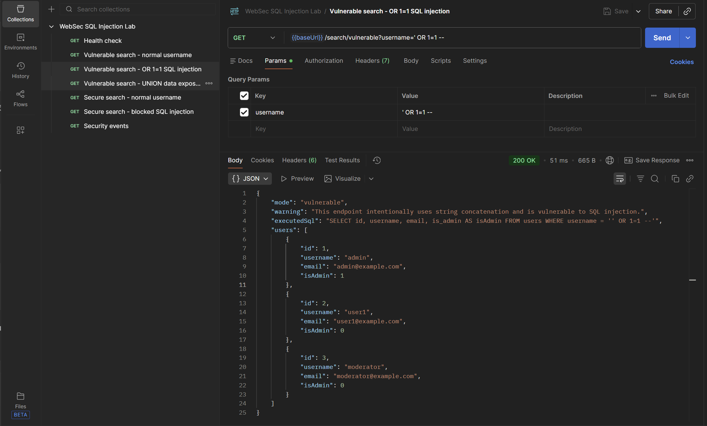
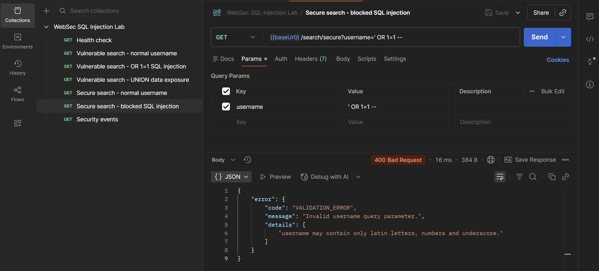
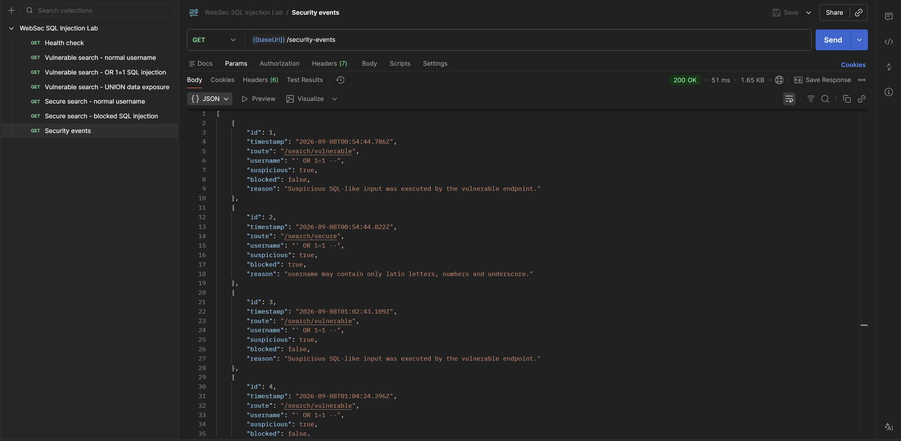

**English** | [Русский](README.ru.md)

# WebSec SQL Injection

**WebSec SQL Injection** is an educational backend security lab built with **Node.js + Express + SQLite**, demonstrating SQL Injection and a secure implementation of the same API workflow.

The project deliberately provides two endpoints:

- **vulnerable** — constructs SQL queries through string concatenation;
- **secure** — uses parameterized queries, allowlist validation, and response filtering.

> The vulnerable endpoint exists exclusively for local learning and testing. This project is not a guide to attacking real systems.

## Skills demonstrated

- SQL Injection through unsafe string concatenation;
- the `OR 1=1` scenario in an isolated demo API;
- UNION-based data exposure in a training database;
- parameterized queries as the primary defense;
- allowlist validation of user input;
- excluding the `password` field from secure API responses;
- logging suspicious search events;
- a consistent JSON error format;
- OpenAPI, Postman, automated tests, and GitHub Actions CI.

## Tech stack

- Node.js
- Express
- SQLite
- JavaScript
- Node.js Test Runner
- OpenAPI
- Postman
- GitHub Actions

## Structure

```text
websec-sql-injection/
├── src/
│   ├── routes/
│   ├── middleware/
│   ├── services/
│   ├── data/
│   └── utils/
├── tests/
├── docs/
├── postman/
├── .github/workflows/ci.yml
├── .env.example
├── package.json
└── README.md
```

## Local setup

Local setup requires **Node.js 22.5+** (the project uses the built-in
`node:sqlite` module). The recommended, tested version is **24.15.0**, recorded in
`.nvmrc`. With nvm: `nvm install 24.15.0`, then `nvm use 24.15.0`.
Check `node --version` before `npm ci`: Node 20 is not supported.

Run the commands from the repository root. In PowerShell, copy the environment file
with `Copy-Item .env.example .env`.

```bash
git clone https://github.com/nikamurkaa/websec-sql-injection.git
cd websec-sql-injection
npm ci
npm start
```

Default API address:

```text
http://localhost:3000
```

Stop the server with `Ctrl+C`.

## Endpoints

| Method | Endpoint | Purpose |
| --- | --- | --- |
| `GET` | `/health` | Health check |
| `GET` | `/search/vulnerable?username=...` | Deliberately vulnerable search |
| `GET` | `/search/secure?username=...` | Secure search |
| `GET` | `/security-events` | Search/security event log |

## Vulnerable and secure approaches

The unsafe approach:

```text
SELECT ... WHERE username = '<user input>'
```

where `<user input>` is concatenated into the SQL statement.

The secure endpoint uses a parameterized query, passing the user value separately from the SQL template. It also applies allowlist validation and response filtering.

| Risk | Secure endpoint protection |
| --- | --- |
| SQL Injection | parameterized query |
| Unrestricted input | allowlist username validation |
| Sensitive data exposure | password field excluded from responses |
| Suspicious activity | security event logging |

See [`docs/security-model.md`](docs/security-model.md) for details.

## Local demonstration

### Vulnerable endpoint

The demonstration SQL Injection payload succeeds against the deliberately unsafe endpoint. The API returns multiple records instead of a single user.



### Secure endpoint

The same input is blocked by the secure endpoint through validation and safe SQL parameter handling.



### Security events

Suspicious and blocked requests are recorded in the security event log.



The complete set of local test scenarios is available in [`docs/manual-checks.md`](docs/manual-checks.md).

## Verification

```bash
npm test
npm run check
```

Tests compare vulnerable and secure endpoint behavior and verify validation, response filtering, and security logging.

OpenAPI: [`docs/openapi.yaml`](docs/openapi.yaml).  
Postman: [`postman/`](postman/).

## Status

Completed as an educational lab on **SQL Injection, secure query construction, and API hardening**.

## Author

[Nicole Zhurbenko](https://github.com/nikamurkaa)
